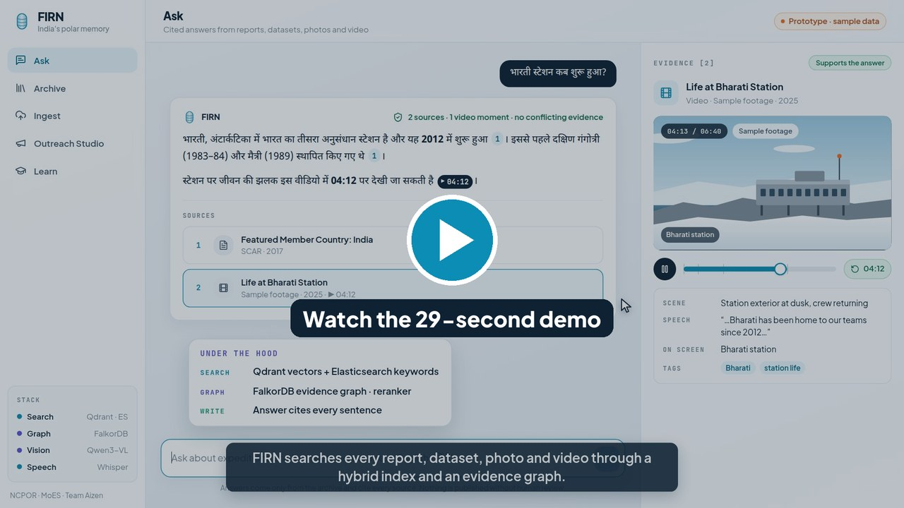
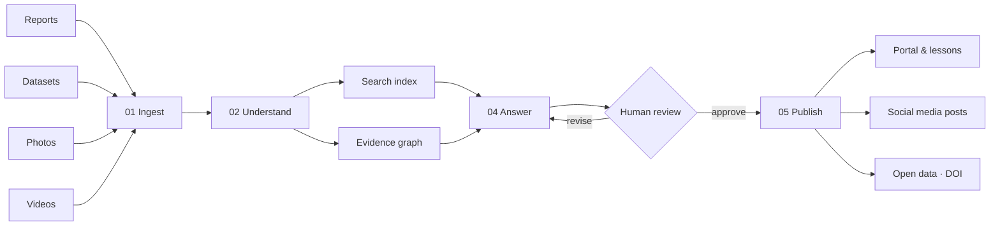

<div align="center">

# FIRN — India's Polar Memory

**An outreach portal, knowledge repository and media dissemination system for India's polar science.**

Every expedition report, dataset, photograph and video becomes searchable, cited and teachable, and can be shared as a human-approved post in 22 Indian languages.


**Team Aizen** · Team ID 177711

</div>

---

## Demo video

[](https://youtu.be/fyM2mMzESK4)

**[▶ Watch the demo on YouTube](https://youtu.be/fyM2mMzESK4)** (29 s, 1080p, with narration and captions) · [Download the MP4](FIRN_demo.mp4?raw=true)

A question is asked in Hindi, FIRN answers with citations, and a click on **▶ 04:12** opens the exact moment in an expedition video.

> The demo runs the prototype UI on a **sample archive**. The four documents are real public NCPOR, SCAR and Government of India pages. The videos, photos and dataset are marked as sample content.

---

## Problem statement

| | |
|---|---|
| **Problem Statement ID** | 26063 |
| **Title** | Integrated Polar Science Outreach, Knowledge Repository and Media Dissemination Portal |
| **Organisation** | Ministry of Earth Sciences (MoES) |
| **Department** | National Centre for Polar and Ocean Research (NCPOR) |
| **Category** | Software |
| **Theme** | Smart Education |

> Develop a comprehensive outreach portal that archives expedition reports, scientific datasets, publications, photographs, videos and institutional activities while generating content for websites and social media.

### Why it matters

- **45** Indian Antarctic expeditions since 1981, but only the scientific reports of **expeditions 1–24** are linked online, from a server on a bare IP address.
- NCPOR's outreach page was last updated in **2016**, and its expedition updates stop at the 42nd expedition (2022).
- Reports, datasets, photos and videos sit on **6–7 separate systems** that can't be searched together, and no one can search *inside* a video.

Figures are from NCPOR's public pages (September 2026); see [References](#references).

---

## What FIRN does



| Stage | What happens |
|---|---|
| **01 Ingest** | Harvests NCPOR's existing systems (NPDC, DSpace) and new uploads: PDF, DOCX, PPTX, audio, images and video |
| **02 Understand** | Reads text (Docling), speech (Whisper), scenes and on-screen text (Qwen3-VL), and cuts videos into shots |
| **03 Connect** | Hybrid search index (vectors + keywords) plus an **evidence graph** that records which sources *support*, *elaborate on* or *contradict* each other |
| **04 Answer** | Retrieves, reranks and writes answers with a **citation on every sentence**, linking to a report page or the exact video second |
| **Review** | An editor approves each output or sends it back. Nothing is published automatically |
| **05 Publish** | Portal pages, grade-level lessons and quizzes, social posts with a source card and AI label, and FAIR metadata export |

### Video pipeline: every shot becomes a searchable record

Shot detection → novelty filter → vision + speech + OCR → record

1. **Shot detection:** PySceneDetect on frames sampled at 1–2 fps.
2. **Novelty filter:** pHash and SigLIP 2 drop near-duplicate frames before any model call. Frames whose on-screen text has changed are always kept.
3. **One vision-model call per shot:** 3–8 frames, plus that span's Whisper transcript and on-screen text, returning structured JSON.
4. **Timestamped records** at shot, scene and video level. Each record keeps start and end times, so an answer can open the video at the exact second.

---

## Features and status

| Feature | Status |
|---|---|
| Ask: cited answers, Hindi and English, citations for document passages and video moments | ✅ Prototype UI (demo mode) · ✅ retrieval engine |
| Hybrid retrieval: vector + keyword + evidence graph + reranker | ✅ Built |
| Document, audio and image ingestion (Docling, Whisper, vision model) | ✅ Built |
| Video pipeline (shots, novelty filter, per-shot vision model call) | 🚧 In progress |
| Timestamps stored end to end (ingest → retrieval → UI deep links) | 🚧 In progress |
| Archive, Ingest, Outreach Studio and Learn screens | 🗓 Planned (in navigation) |
| Review queue, AI labels (IT Rules 2026), C2PA content credentials | 🗓 Planned |
| 22-language translation (IndicTrans2 / Bhashini), FAIR export (DataCite, schema.org) | 🗓 Planned |

---

## Tech stack

| Layer | Technology |
|---|---|
| Ingest | Python · FastAPI · Docling · FFmpeg |
| Vision & speech | Qwen3-VL · SigLIP 2 · PySceneDetect · Whisper |
| Search & graph | Qdrant (vectors) · Elasticsearch + SPLADE (keywords) · FalkorDB (evidence graph) |
| Local models | `nomic-embed-text-v2-moe` (multilingual embeddings) · `bge-reranker-base` · `ModernBERT-large-zeroshot-v2.0` (support/contradict edges) |
| Language | Open-weight LLMs · IndicTrans2 · Bhashini |
| Portal | React 18 · TypeScript · Vite · Tailwind · shadcn/ui |
| Hardware | One 24 GB GPU server on-premises; hosting on NIC / MeghRaj GI Cloud with data kept in India |

> **Prototype note:** the language models (chat, metadata and vision) are open-weight models called through **OpenRouter**. Embeddings, reranking, NLI, Whisper, Docling and SigLIP run **locally** on the GPU. In production, the same open-weight models can be self-hosted (for example with vLLM), so no data needs to leave NCPOR.

---

## Quick start

### 1. Demo mode: UI only, no backend or GPU needed

```bash
cd frontend
npm install
npm run dev
```

Open <http://localhost:8080>. Try a suggested question, or open a question link directly:
`http://localhost:8080/?q=When did the 45th expedition reach Maitri?`

### 2. Full stack

**Prerequisites:** Docker + Docker Compose v2, NVIDIA GPU (8 GB+ VRAM) with the NVIDIA Container Toolkit, Python 3.10+, Node.js 18+, and an OpenRouter API key.

```bash
# 1. Configuration: copy the templates and fill in your keys (never commit .env)
cp backend/chat_pipeline/.env.example backend/chat_pipeline/.env
cp backend/ingestion_pipeline/.env.example backend/ingestion_pipeline/.env

# 2. Infrastructure: Elasticsearch, Qdrant, FalkorDB, Redis and the GPU model service
docker compose up -d

# 3. Python dependencies
pip install -r backend/chat_pipeline/requirements.txt
pip install -r backend/ingestion_pipeline/requirements.txt

# 4. APIs
python backend/chat_pipeline/scripts/run_api.py                # http://localhost:8000
python backend/ingestion_pipeline/scripts/run_ingestion_api.py # http://localhost:8001

# 5. Frontend, connected to the real backend
cd frontend && VITE_DEMO_MODE=false npm run dev
```

---

## Project structure

```
FIRN_SourceCode/
├── FIRN_demo.mp4                  # 29-second demo video
├── docs/assets/                   # README images
├── docker-compose.yml             # Elasticsearch, Qdrant, FalkorDB, Redis, model service
│
├── frontend/                      # React + TypeScript portal
│   └── src/firn/
│       ├── pages/                 # Ask (more screens planned)
│       ├── components/            # App shell, evidence panel, video-moment player
│       ├── demo/                  # Sample archive used in demo mode
│       ├── api.ts                 # Demo API and real backend adapter
│       └── store.ts               # Ask state (zustand)
│
├── backend/
│   ├── chat_pipeline/             # Chat API (port 8000): retrieval engine, citations, sessions
│   └── ingestion_pipeline/        # Ingestion API (port 8001): Docling, Whisper, vision, graph building
│
└── model_service/                 # Local GPU service (port 7997): embeddings, rerank, NLI classify
```

---

## API reference

**Chat pipeline** (`localhost:8000`)

| Method | Endpoint | Description |
|---|---|---|
| `POST` | `/api/chat` | Ask a question; returns the answer with retrieved chunks |
| `POST` | `/api/chat/stream` | Streaming version of `/api/chat` |
| `POST` · `GET` | `/api/sessions` | Create or list sessions |
| `GET` | `/api/sessions/{id}` | Session detail |
| `GET` | `/api/sources` | List indexed documents |
| `GET` | `/admin/database-stats` | Database statistics |
| `POST` | `/admin/clear-databases` | Clear all databases (destructive) |
| `GET` | `/health` | Health check |

**Ingestion pipeline** (`localhost:8001`)

| Method | Endpoint | Description |
|---|---|---|
| `POST` | `/api/processing/upload` | Upload files |
| `POST` | `/api/processing/start` | Start a processing job |
| `GET` | `/api/processing/status/{job_id}` | Job status |
| `GET` | `/api/processing/jobs` | List jobs |
| `GET` | `/health` · `/metrics` | Health and metrics |

**Model service** (`localhost:7997`)

| Method | Endpoint | Description |
|---|---|---|
| `POST` | `/v1/embeddings` | Embeddings (OpenAI-compatible) |
| `POST` | `/v1/rerank` | Rerank passages against a query |
| `POST` | `/v1/classify` | Classify how two passages relate (supports, contradicts, …) |
| `GET` | `/health` | Health check |

---

## Governance and compliance

FIRN is designed around the rules an Indian government portal must meet:

- **GIGW 3.0 / WCAG 2.1 AA:** captions and alt text are generated for every asset.
- **DPDP Rules 2025:** face detection, a consent register and blurring before public release.
- **CERT-In directions:** audit logs for every approval and publication.
- **IT Rules 2026 (synthetic content):** real footage by default, and visible AI labels plus C2PA content credentials on anything generated.
- **Access levels:** enforced before the model reads any passage, so restricted data can't leak into answers.

---

## Roadmap

1. **Prototype (SIH Grand Finale):** sample archive, cited Q&A, bilingual portal, video pipeline.
2. **Pilot (NCPOR, Goa):** full archive harvested from NPDC and DSpace, 22 languages, live social posting from NCPOR accounts.
3. **Scale (MoES institutes):** a shared platform, with metadata exported to global polar directories (SCAR / GCMD).

---

## References

1. NCPOR. *Scientific Reports of Indian Expeditions to Antarctica.* <https://ncpor.res.in/news/view/425>
2. NCPOR. *India's Antarctic Research Season 2025–26 Commences.* <https://ncpor.res.in/news/view/929>
3. Government of India. *The Indian Antarctic Act, 2022.* [Full text (PRS)](https://prsindia.org/files/bills_acts/acts_parliament/2022/The%20Indian%20Antarctic%20Act,%202022.pdf)
4. SCAR. *Featured Member Country: India.* <https://scar.org/scar-news/india-feature>
5. Ren et al. *VideoRAG: Retrieval-Augmented Generation with Extreme Long-Context Videos.* [arXiv:2502.01549](https://arxiv.org/abs/2502.01549)
6. Luo et al. *Video-RAG: Visually-aligned Retrieval-Augmented Long Video Comprehension.* [arXiv:2411.13093](https://arxiv.org/abs/2411.13093)
7. Qwen Team. *Qwen3-VL Technical Report.* [arXiv:2511.21631](https://arxiv.org/abs/2511.21631)
8. Guo et al. *LightRAG: Simple and Fast Retrieval-Augmented Generation.* [arXiv:2410.05779](https://arxiv.org/abs/2410.05779)
9. Gala et al. *IndicTrans2: Towards High-Quality and Accessible Machine Translation Models for all 22 Scheduled Indian Languages.* [arXiv:2305.16307](https://arxiv.org/abs/2305.16307)
10. Wilkinson et al. *The FAIR Guiding Principles for scientific data management and stewardship.* Scientific Data, 2016. [doi:10.1038/sdata.2016.18](https://doi.org/10.1038/sdata.2016.18)

---

<div align="center">
<sub>FIRN · Team Aizen · Smart India Hackathon 2026 · PS 26063</sub>
</div>
